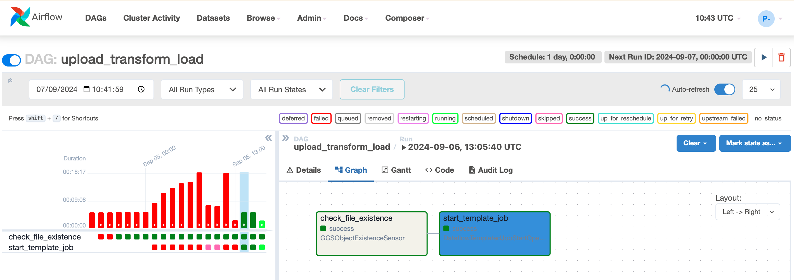

# Memoria de trabajo
## Gestión del worflow - Apache Ariflow
### Primera versión
En primer lugar utilizamos apache airflow en local haciendo uso de una base de datos postgres. Esta primera versión solo ejecutaba una tarea que consistía en un comando bash para lanzar un pipeline de dataflow que escribía un csv a una tabla de big query. 

### Pasos intermedios
A medida que nos hemos ido acercando a la versión básica definitiva, hemos integrado una tarea anterior que comprueba que existe un archivo csv en un bucket de GCS. Si existe, se lanza la segunda tarea (Pipeline Dataflow).

Algunos de los pasos en este proceso han consistido en utilizar distintos operadores de Apache Airflow - GCP/GCS. Hemos probado también las alternativas plantilla flexible/clásica, en los commits se pueden comprobar las distintas pruebas.

### Versión básica definitiva
En último lugar, hemos llegado a una versión básica (ya que es la idea integrar más pasos del workflow en la gestión administrada por airflow) pero consistente y elegante. Hemos programado dos tareas:
- La primera comprueba que el csv de entrada existe en un bucket de GCS haciendo uso del operador [GCSObjectExistenceSensor](https://airflow.apache.org/docs/apache-airflow-providers-google/stable/_api/airflow/providers/google/cloud/sensors/gcs/index.html).
- La segunda utiliza el operador [DataflowTemplatedJobStartOperator](https://airflow.apache.org/docs/apache-airflow-providers-google/stable/_api/airflow/providers/google/cloud/operators/dataflow/index.html) para lanzar un pipeline de Dataflow basado en una plantilla clásica. Para más documentación [click aquí](https://cloud.google.com/dataflow/docs/guides/templates/provided/cloud-storage-csv-to-bigquery).
- La configuración del programador de airflow lanza el DAG una vez cada 24h.

